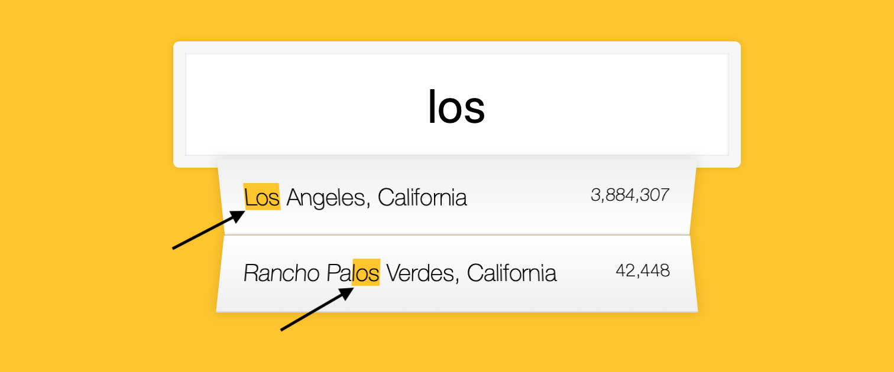

# 06 - Ajax Type Ahead
## 1. `fetch` API  

In this project, we need to make a http request to get data about cities and population. Previously, we use `XMLHttpRequest` to make requests to server asynchronously. Now, we can `fetch`.  

The basic usage of `fetch` is:  
```
fetch(url)
    .then(response => {/* code if successful */}, 
            error => {/* code if some error */});
```
`fetch` API returns a `Promise` object. Thus, we can use `then()` to handle both the successful/failed situations.  

If the http request is successful, we will receive a `Response` object, which contains the data in its `body` property. To access the data, we have several method to choose. Here, we use `json()` to get the parsed body data because we already know the target data is in JSON. 
```
    fetch(endpoint)
      .then(blob => blob.json())
      .then(data => cities.push(...data))
      .catch(err => console.log('Request failed', err));
```  
If we request an image, we can use `blob()` to get the raw data:  
```
    const testUrl = 'https://images.unsplash.com/photo-1603417023616-aa1fbeed0a22?ixid=MXwxMjA3fDB8MHxwaG90by1wYWdlfHx8fGVufDB8fHw%3D&ixlib=rb-1.2.1&auto=format&fit=crop&w=780&q=80';
    fetch(testUrl)
      .then(reponse => reponse.blob(), error => console.log(error))
      .then(blob => {
        const imgUrl = URL.createObjectURL(blob);
        const testImg = document.querySelector('img');
        testImg.src = imgUrl;
      })
```  


## 2. `input` Event  

Here, Wes uses the `change` and `keyup` events so that we can monitor each alteration of the `<input>`. This is because the `change` event is **not** fired whenever a change happens. For `<input type='text'>`, `change` event is fired only when the control loses focus (i.e. enter some text in the input area and click somewhere else).  

Alternatively, I use `input` event here to achieve the goal. This event will be fired whenever the value changes.  

    
## 3. Use `innerHtml` to update html code block  

In this project, we use a `<ul>` to display the suggestions (matched cities/states). Each time when we find the matched places, we need to update the `<li>`s.  

There are two ways to update the `<li>`s:  
- use `document.createElement`, `textContent`, `element.appendChild` and related methods
- use `element.innerHtml`  

Since in this project we usually need to update a bunch of `<li>`s, using `innerHtml` will be easier. Or, we will have long lines of codes to create a single new `<li>`.  


## 4. `replace()` method of `String`  

I once found it complex to implement the 'highlight' effect of the matched texts as shown below.  

  
To implement this effect, for the `<li>` element, we need have a structure like below:  
```
<li>
    <span>
        <span class='hl'>search keyword</span>
         remaining place names
    </span>
    <span class='population'>number</span>
</li>
```  
I previously used `document.createElement` and related methods to add new `<li>`s to the list. In this way, to create the above structure needs multiple lines of code. Not to mention the work to split the place name into the matched part and the remaining parts 😨.

Wes applies a light approach to achieve this - using `innerHtml` and `String.replace()`. With `replace()`, we can replace a certain part of string, which matches the given regular expression, with the new texts. Thus, we can process the place name like below.
```
const cityName = match.city.replace(regex, `<span class='hl'>${this.value}</span>`);
```  


