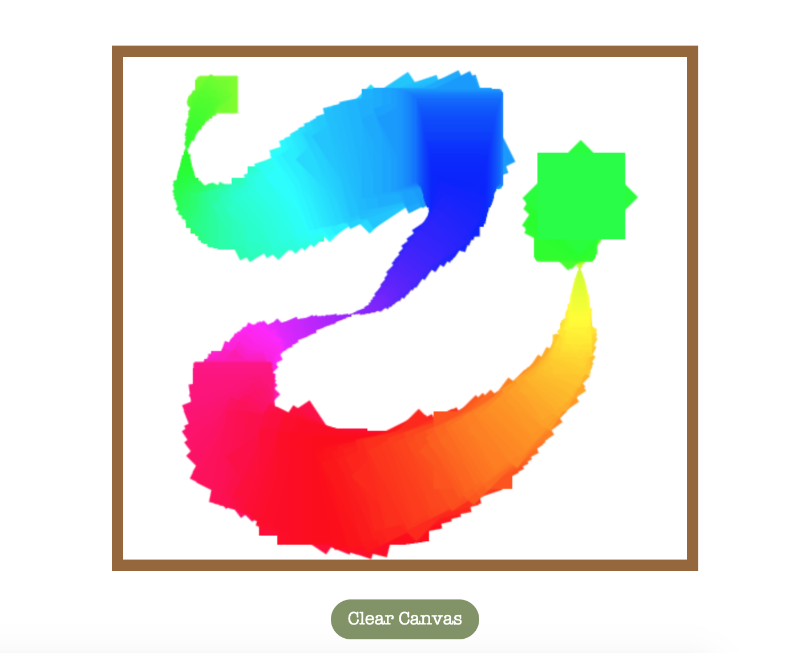
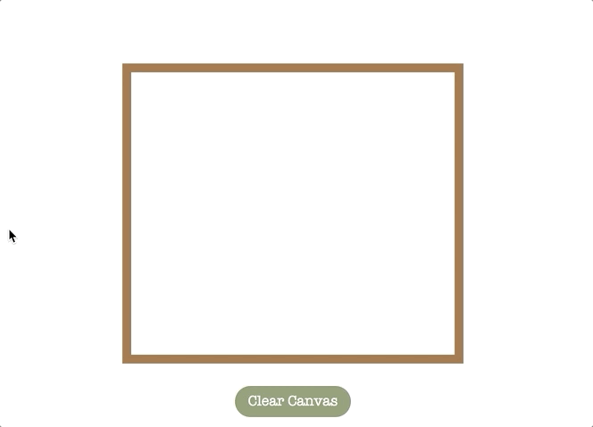
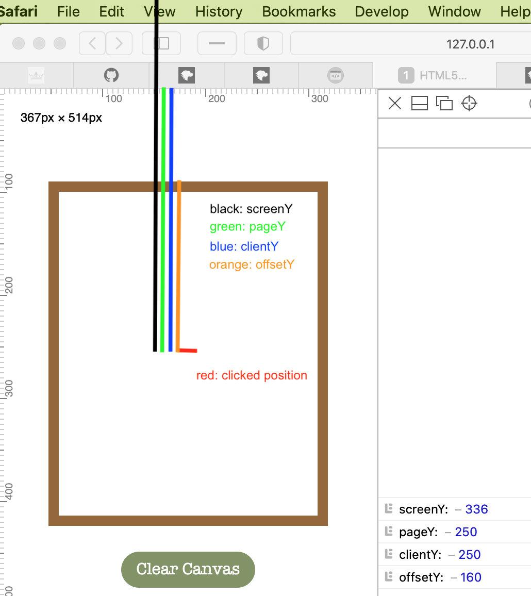
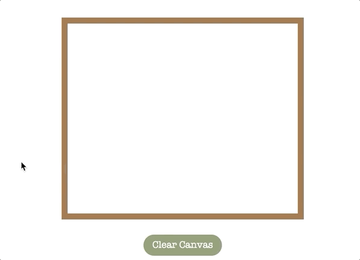

# 08 - HTML5 Canvas 

**[Live Demo](https://maplex612.github.io/JS30/08%20-%20Fun%20with%20HTML5%20Canvas/index-MAPLE.html)**  

## 1. Canvas API  
With Canvas API, we can draw graphics with JS and HTML `<canvas>` element.  

The basic usage (2D graphics) is recapped here:  
- In HTML, add a `<canvas>` element
    ```
    <canvas id="draw" width="800" height="800"></canvas>
    ```
- In JS,  
    - Get the canvas element and rendering context, set the canvas size 
        ```
        const canvas = document.getElementById('draw');
        const ctx = canvas.getContext('2d');
        ctx.width = window.innerWidth;
        ctx.height = window.innerHeight;
        ```  
    - Apply the style and color  
        ```
        ctx.strokeStyle = '#000'; //set the stroke color
        ctx.fillStyle = '#fff'; //set the color when filling the shape
        ctx.lineWidth = 2;
        ctx.lineCap = round;
        ```  
    - Draw shapes  
    
        To draw **rectangles** and **paths**, Canvas API offers methods to do it. If you want to draw other shapes, you need to combine **paths** to implement the shape.   
    
        For **rectangles**, we can use `ctx.fillRect(startX, startY, rectWidth, rectHeight)` to draw a filled rectangle and `ctx.strokeRect()` to draw an outline.  
        
        To draw **paths**, we need to first set the paths (coordinates) and then draw them with `stroke()` or `fill()`. E.g.  
        ```
        //draw a straight line from (0, 0) to (50, 50)
        ctx.beginPath(); //begin a path
        ctx.moveTo(0, 0); 
        ctx.lineTo(50, 50); 
        ctx.stroke(); //draw the line

        //draw a filled right triangle
        ctx.beginPath();
        ctx.moveTo(0,0);
        ctx.lineTo(0,20);
        ctx.lineTo(20,20);
        ctx.fill(); //fill() will close the open shapes automatically
        ```  
  
## 2. HSL color model  
In this project, we want the stoke color to change continously, like the light spectrum.  
<div align=center></div>

To implement this, using RGB color model will be difficult, because the color is decided by three values and the change will not be intuitive.  

HSL color model will solve the problem. Colors are represented by the notation `hsl(hue, saturation, lightness)`. `hue` is a unitless number, `saturation` and `lightness` are percentage. In this model, `hue` is the **only** value to decide the color, which is interpreted as degrees (red=0deg, green=120deg, blue=240deg etc.). Thus, to change the stroke color, we only need to update the `hue`.


## 3. MouseEvents: `mousedown`, `mouseup`, `mouseout`, `mousemove`  
In this project, we want to implement this scenario: when we keep mouse down and move, a line will be drawn to show our moving path.  

Firstly, I use `mousedown` event only to do the work. Then, I find that it will only be fired for the initial mousedown. During the time when we keep pressing, the event will not be fired (shown as the .gif below).  
<div align=center></div>

Thus, I use `mousemove`, `mousedown` and `mouseup` together to do the job. With `mousemove`, we can get the coordinates of the mouse when we keep pressing and move the mouse. The other two events are used to decide if we draw or not.  

One more problem here is (shown below): when we keep pressing, move the pointer out of the canvas, and then move the pointer into the canvas, the drawing status is still on.
<div align=center></div>  

To solve it, Wes uses `mouseout` event to turn off the drawing mode when mouse is out of the canvas.

## 4. Some MouseEvent properties  

MouseEvents play an important role in this project. With them, we can get the coordinates of the mouse and draw our lines. Here is my recap on the difference of four coordinate values (`screenY`, `pageY`, `clientY`, `offsetY`) of a mouseEvent:  
<div align=center></div>  
  

Another property I used here is `MouseEvent.button`. It tells which button was pressed on the mouse and triggered the event. It returns a number (`0`: main button, usually the left button; `2`: secondary button, usually the right button).  

I used this property to solve a problem shown below: after I right-clicked the canvas, it continued drawing when I moved the mouse, even though I was not pressing any mouse button. 
<div align=center></div>  

The reason here is clicking the secondary button can trigger `mousedown`, but `mouseup` will **not** be triggered. Thus, the drawing mode is still on.  

To solve the problem, in the `mousedown` event handler, I used `MouseEvent.button` to make sure that only when the main button (usually the left button) is pressed and moved, we draw lines.
